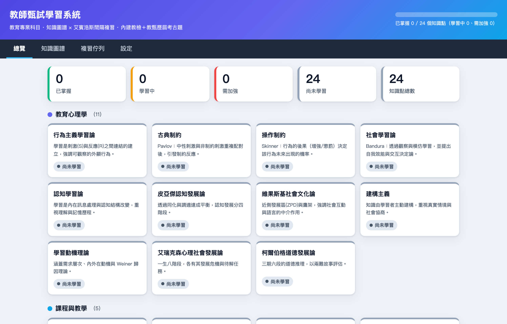
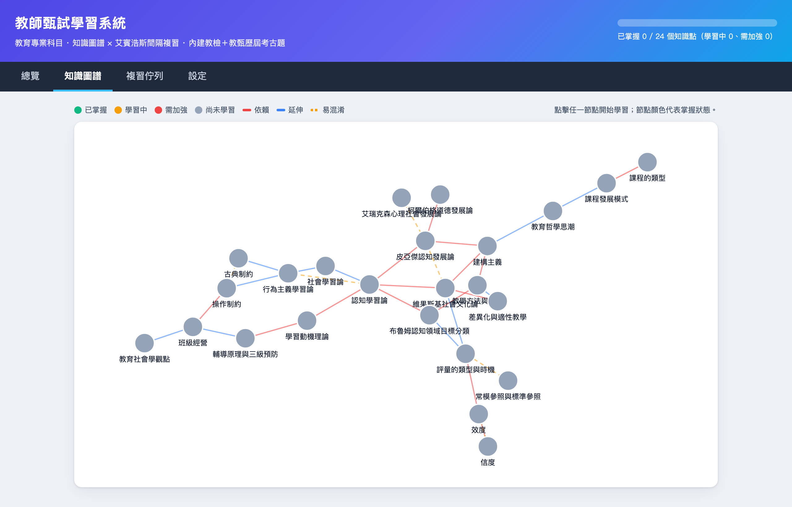

# 教師甄試學習系統

> 教育專業科目 · 知識圖譜 × 艾賓浩斯間隔複習 · 內建教檢＋教甄歷屆考古題

一套**純前端、零外部相依、可離線使用**的教師甄試（教育專業科目）學習系統。以**知識圖譜**組織知識點、以**艾賓浩斯間隔複習**排程複習，測驗題庫全為**真實歷屆考古題**。整個系統是靜態檔（HTML/CSS/原生 JS），可直接壓縮成 zip 分享。

## 特色

- **📚 知識圖譜** — 24 個知識點、31 條關係邊，橫跨 5 大領域（教育心理學／課程與教學／教育測驗與評量／班級經營與輔導／教育學基礎）。以力導向圖視覺化，邊依關係類型（依賴／延伸／易混淆）著色。
- **🧠 間隔複習** — 艾賓浩斯遺忘曲線排程；答對率決定掌握狀態（🟢 綠 ≥0.8／🟡 黃 ≥0.5／🔴 紅），答對推進間隔、答錯歸零，紅色節點高頻回到複習佇列。
- **📝 官方考古題題池** — 全庫 **134 題真實考古題**（每知識點 3–9 題）：**118 題教檢**（民國 94–115）＋ **16 題教甄**（中策聯盟 2026）。每次測驗**隨機抽 5 題、選項亦隨機排序**，背不起來。
- **✅ 零 AI 編造** — 每題 `answer` 直接取自官方答案卷，題幹／選項逐字取自官方語料，**不附任何 AI 解析**。作答後只顯示官方答案與**可回查依據**（教檢＝官方試卷代碼、教甄＝官方答案卷 PDF 連結）。
- **💾 本機進度** — 進度存於瀏覽器 localStorage，支援 JSON 匯出／匯入備份。

## 介面預覽

**總覽** — 依領域分組的知識點卡片，即時顯示紅／黃／綠掌握狀態與整體進度。



**知識圖譜** — 力導向佈局，邊依關係類型（依賴／延伸／易混淆）著色，點節點即進入學習。



**課程講義** — 每個知識點附精簡講義與關聯知識點；測驗前明示「隨機抽題、零 AI 解析」。


**官方考古題測驗** — 作答後只顯示官方答案與**可回查依據**（教檢＝官方試卷代碼、教甄＝官方答案卷連結），不附任何 AI 編造解釋。


## 快速開始

無建置步驟。因使用 localStorage，請以 http 伺服器（而非 `file://`）開啟根目錄：

```bash
python3 -m http.server 8000
# 瀏覽 http://localhost:8000/index.html
```

## 專案結構

```
index.html          應用外殼與四個分頁（總覽／知識圖譜／複習佇列／設定）
css/style.css       樣式，含紅／黃／綠掌握狀態配色
js/
  data.js           知識圖譜資料（節點／邊／考古題題池）— 由 build-pool.js 建置，勿手改
  srs.js            間隔複習排程（艾賓浩斯遺忘曲線）
  storage.js        localStorage 進度儲存 + JSON 匯出／匯入
  graph.js          純 SVG 知識圖譜視覺化（Fruchterman–Reingold 力導向佈局）
  app.js            UI 邏輯：分頁、課程彈窗、隨機抽題測驗
tools/
  pool.json         官方考古題題池原始資料 — 題庫的單一真實來源
  build-pool.js     建置腳本：驗證 pool.json 後併入 js/data.js（冪等）
NOTES.md            開發筆記與驗收紀錄
```

## 更新題庫

題庫的單一真實來源是 `tools/pool.json`。要新增／修改題目，編輯該檔後重新建置：

```bash
node tools/build-pool.js
```

建置腳本會驗證每題結構（答案索引範圍、四選項齊全、去重、排除 OCR 殘渣、`src`/`ref` 齊備），通過後才寫回 `js/data.js`。**未公布官方答案的題目（`answer: null`）一律不採用。**

考古題來源為 Twinkle Hub MCP：`search_teacher_exam_questions`（教檢，~12,700 題）與 `search_teacher_recruit_questions`（教甄，~2,400 題）。詳見 [NOTES.md](NOTES.md)。

## 授權

[MIT](LICENSE)
